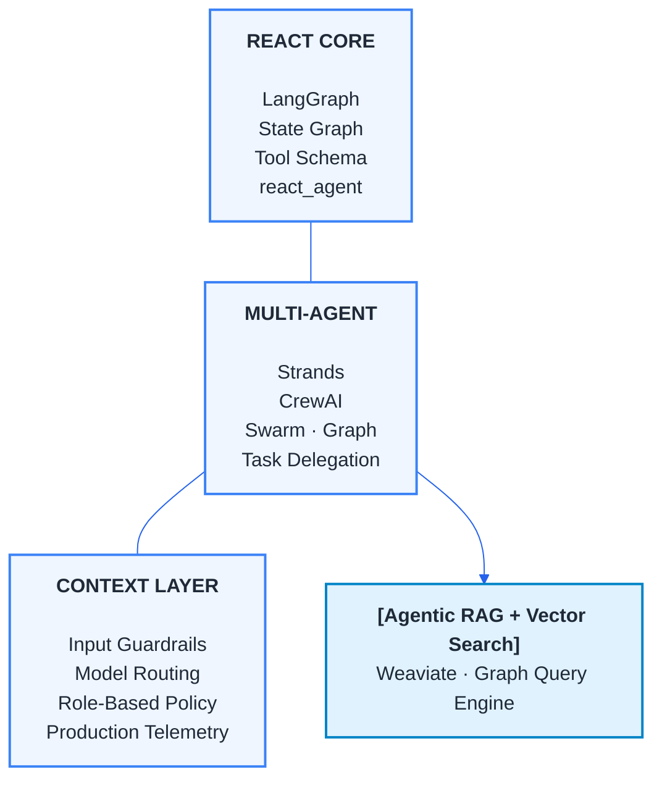
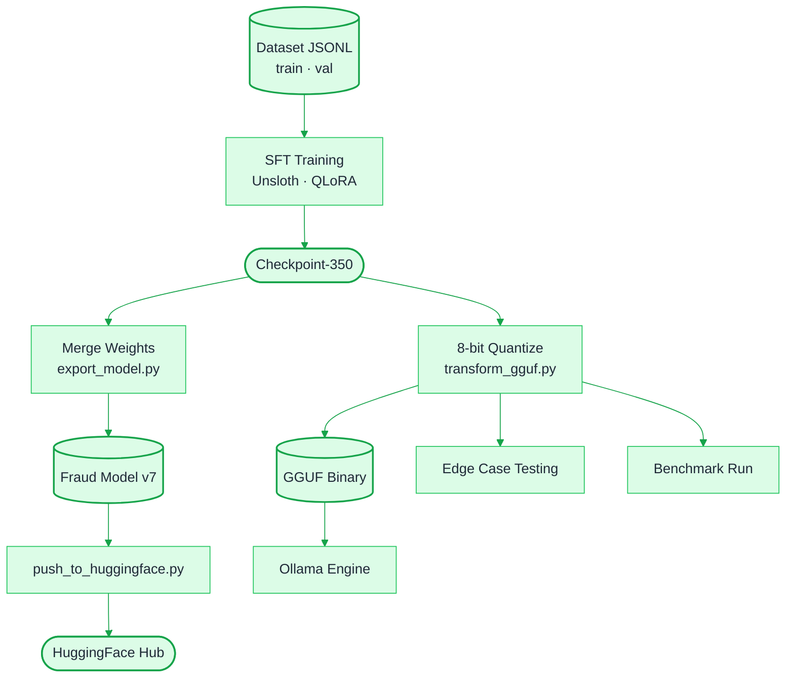
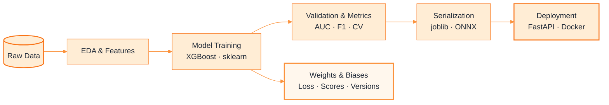
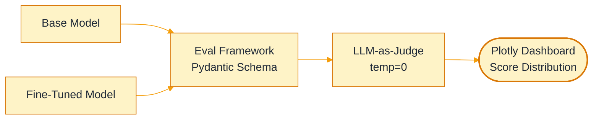
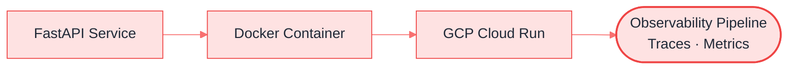

# Maxwell Mensah

### Production: AI, Agents & ML

**$$ \color{#2563eb}{\textsf{Agentic Systems Architecture $\cdot$ Model Engineering $\cdot$ LLMOps}} $$**

I train models, build agentic systems, and ship the evaluation
and infrastructure  layers that keep AI reliable in production.

📍 Ghana, West Africa &nbsp;&nbsp;·&nbsp;&nbsp; 🌍 Worldwide

<table>
  <tr>
    <td align="center"><a href="#agents"><code>[01] AGENTIC SYSTEMS</code></a> LangGraph · Strands · MCP</td>
    <td align="center"><a href="#finetuning"><code>[02] MODEL ENGINEERING</code></a> LoRA · GGUF · Unsloth</td>
    <td align="center"><a href="#evaluation"><code>[03] EVALUATION</code></a> LLM-as-Judge · RAG Evals</td>
    <td align="center"><a href="#production"><code>[04] PRODUCTION</code></a> GCP · Docker · Observability</td>
  </tr>
</table>

**Engineering stance:** Agents fail in production differently than in demos.   
I build for failure first. Evaluation, observability, and guardrails before features.

<b>[01] AGENTIC SYSTEMS</b> &nbsp;—&nbsp; LangGraph · Strands · CrewAI · MCP

 

**→ [`agentic_engineering`](https://github.com/MaxwellMensah/agentic_engineering)**

Production-grade AI agent design patterns, autonomous system architectures, and multi-framework orchestration.

* **Orchestration**: LangGraph graph-based state machines, Strands multi-agent swarms, CrewAI task pipelines
* **Context Engineering**: Input guardrails, dynamic model routing, role-based tool policy, production telemetry
* **Architecture Analysis**: Comparative breakdown — Strands vs CrewAI across task delegation, memory, and tool-use APIs

<b>[02] MODEL ENGINEERING</b> &nbsp;—&nbsp; LoRA · GGUF · Unsloth · PyTorch · XGBoost

 

**→ [`fine_tuning_modeling`](https://github.com/MaxwellMensah/fine_tuning_modeling)**

End-to-end model engineering across two paradigms — LLM domain adaptation and classical ML research pipelines.

**▸ LLM Domain Adaptation**

**▸ Traditional ML Research & Training**

* **LLM Fine-Tuning**: PEFT via QLoRA/LoRA using Unsloth — dataset curation, SFT, checkpoint management
* **Export**: 16-bit merged weights + 8-bit GGUF quantization for local inference via Ollama
* **Classical ML**: End-to-end research pipelines — feature engineering, model selection, cross-validation, serialization
* **Evaluation**: Edge case testing suite and base vs. fine-tuned model comparison on domain-specific metrics

<b>[03] EVALUATION HARNESS</b> &nbsp;—&nbsp; LLM-as-Judge · RAG Evals · Plotly

 

**→ [`LLM-evaluations`](https://github.com/MaxwellMensah/LLM-evaluations)**

Local multi-dimensional evaluation framework — the bridge between raw model output and business logic reliability.

* **Metrics**: LLM-as-a-Judge faithfulness scoring, embedding-based relevancy, hallucination reduction
* **Reliability**: Deterministic grading with Pydantic schema enforcement and `temperature=0` judge controls
* **Observability**: Interactive Plotly dashboards for score distribution and regression monitoring

<b>[04] PRODUCTION ENGINEERING</b> &nbsp;—&nbsp; GCP · Docker · Kubernetes · Observability

 

**→ [`production_engineering`](https://github.com/MaxwellMensah/production_engineering)**

LLMOps infrastructure, containerized AI microservices, and agent observability pipelines.

* **Infrastructure**: GCP Cloud Run autoscaling, Docker containerization, Kubernetes pod management
* **Reliability**: Cost/latency optimization, circuit breakers, graceful degradation strategies
* **Observability**: Distributed tracing, eval harnesses, agent monitoring pipelines

## TECHNICAL STACK

| Layer | Technologies |
| --- | --- |
| **Agentic Frameworks** | LangGraph · Langsmith · Strands · CrewAI · MCP |
| **ML Stack** | PyTorch · Scikit-learn · XGBoost · Pandas · NumPy · Matplotlib · Weights & Biases |
| **Model Engineering** | Unsloth · HuggingFace · LoRA/QLoRA · GGUF · Ollama |
| **LLM APIs** | Gemini · Claude · OpenAI · Bedrock |
| **Production & Infra** | GCP · Docker · Kubernetes · Cloud Run · FastAPI |
| **Evaluation** | LLM-as-Judge · RAG Evals · Plotly · Pydantic |

Committing daily · Building in public

